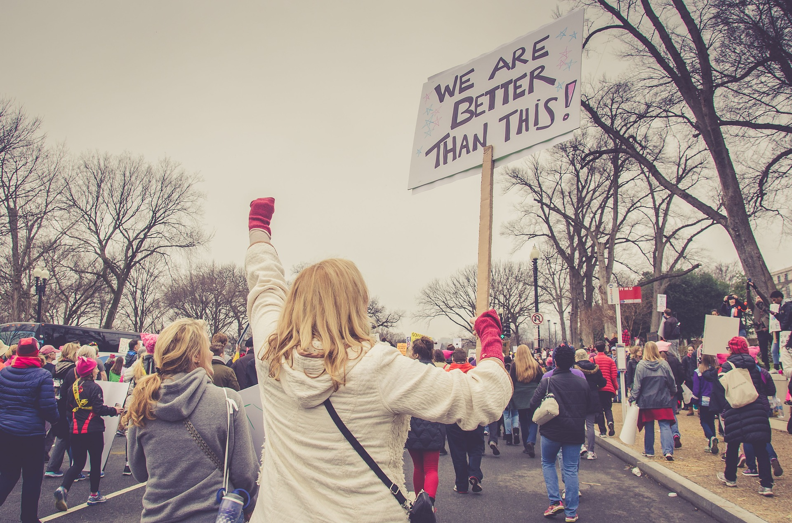

I stared hazily at the blue glow of the television. I'd been drinking a little whiskey. Actually... I'd been drinking a lot of whiskey.

I was watching the returns of the presidential election, and they'd just called Michigan. At this point, it was brutally obvious that Donald Trump was going to be 45th President of the United States.

Fumbling for the remote, I turned off the television, then sat back in my chair and rubbed my tired eyes.

---

Earlier that morning, Niki and I had walked down the street to the nearby church that served as our polling place and done our civic duty. I'd been glued to the television pretty much since we got home, waiting for exit polls and then the actual returns.

Like pretty much everyone else, I was convinced that it would be a strong victory for Hillary Clinton. I had my reservations about Clinton, but her politics were reasonably aligned with mine, and I admired her ability to succeed in a role which is dominated by men.

I was also pretty convinced that Donald Trump was a narcissitic lunatic that at best would be completely inept, and at worst would be the first truly fascist president in American history. It was obvious to me who to vote for, and it seemed obvious to me who should win.

And, like pretty much everyone else, I couldn't believe what was happening as the votes were tallied and the talking heads -- exasperated themselves -- called state after state for Trump.

At this point, you probably think I'm going to go on a tirade about the dangers of American fascism or say mean things about Trump or the people who voted for him. But I'm sure you've heard all that before.

Instead, I'd rather talk about *bodhicitta*.

---

Stumbling through the darkened house, I found my way to bed and laid down next to Niki. She'd made the wise decision of going to sleep rather than staying up to watch the returns. She stirred, and rolled over.

"So what happened?" she asked, still groggy.

"It looks like it's going to be President Trump," I replied. The words felt foreign, like I was speaking some new language that had just been invented that evening as the election results were announced.

She sat upright. "You're fucking kidding me." She grabbed her iPad to check for herself. She knows I'm fond of trying to play these kinds of jokes on her. They never work, of course, but they always make me giggle like an idiot.

This time I wasn't laughing.

I laid back on my pillow, but in spite of being exhausted and more than a little drunk, sleep didn't come. My mind raced, eventually landing on a singular thought that stuck to my brain like superglue.

*How in the world did I not see this coming?*

I'd followed the entire awful, shit-stained, mud-raking, rather-rip-your-eyes-out-than-watch-another-moment campaign. I'd digested every news clip, watched every debate, and read the spin and counter-spin on every talking point. But somehow, I'd missed something critical. Staring at the ceiling that night, I needed to understand what I'd missed.

---

