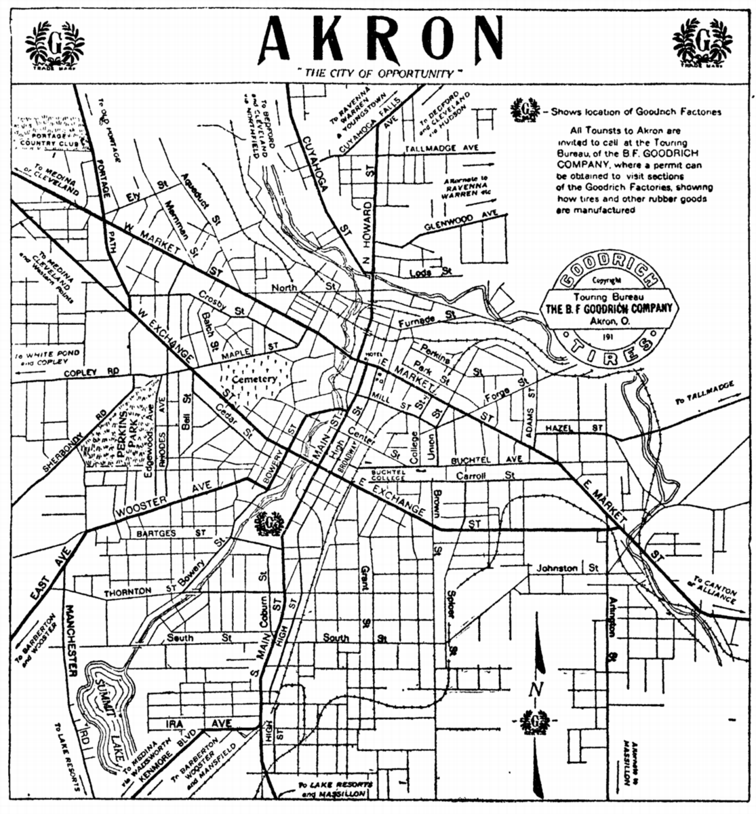
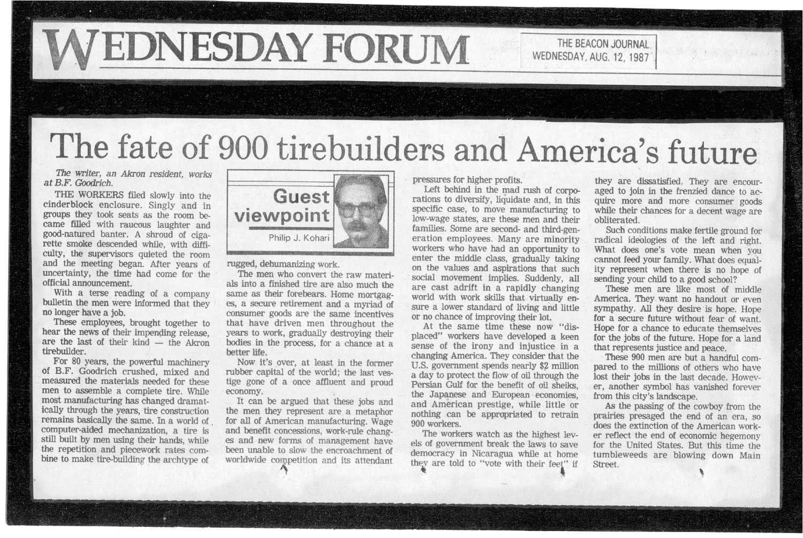
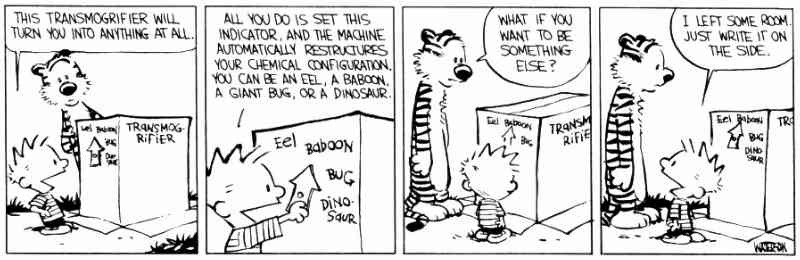
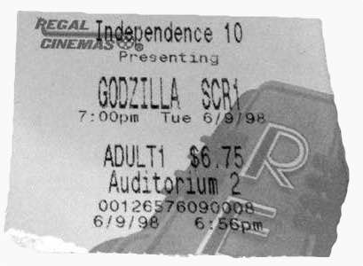

**Hi, I'm Nate Kohari**. I've been writing software since I was nine years old, and making money doing it for the last ten years. Most recently, I co-founded [TaskTorch](http://tasktorch.com) with my wife and partner-in-crime [Niki](http://nikibeth.com).

We live in Raleigh, North Carolina, but we're originally from Akron, Ohio.

Throughout most of the 20th century, Akron was the "rubber capital of the world" and a seat of industry, home to Goodyear, B.F. Goodrich, and Firestone. The neighborhood I grew up in was called [Goodyear Heights](http://en.wikipedia.org/wiki/Neighborhoods_in_Akron,_Ohio#Goodyear_Heights), and was originally built specifically to house people that worked at the Goodyear factories. I attended Seiberling Elementary School (named for a president of Goodyear), and later Goodyear Middle School.

You get the picture. Akron was a city built on rubber.

Then, in the 1980s, as globalization started to take hold and industry left America, most of the city's rubber factories shut down. My father had worked for years — many of them on the night shift — at the B.F. Goodrich factory until it closed in 1987, leaving him and 900 other tirebuilders out of work.

In the years that followed, Akron became part of the "rust belt," a wide and long swath of burned-out post-industrial towns that cuts through the American midwest from Detroit to Buffalo. My dad was able to reinvent himself and begin a new career, but many others weren't as fortunate. The city has yet to recover.

I learned early how quickly the status quo can change, the value of a healthy distrust of authority, and the power of being in control of your own destiny.

---

I was kind of a strange kid. I used to play with cardboard boxes, drawing complicated computers on them with a Sharpie, and sitting in front of them for hours pretending to press the buttons. The exact function of the imaginary machines is lost to my youth. Spaceships and stuff, no doubt, I dunno.

For Christmas in 1989, my grandfather bought us our first computer, a Tandy 1000 SX. Rather than spend a lot of money on games, my mom bought a book called [Basic Computer Games](http://www.amazon.com/BASIC-Computer-Games-Microcomputer-Edition/dp/0894800523), and painstakingly copied the BASIC source code from the book into the interpreter.

I still remember, and quite vividly, the moment I connected that the BASIC code from the book defined the rules of the game. By changing the code, I could change the rules of the game. I could give myself the high score, make my character jump higher, whatever I wanted. I could tell the compute what to do. I was in control.

For an awkward kid not quite sure of himself, being in charge of a world — even a tiny one living in a glowing box on the desk — was empowering. I was immediately hooked, and a programmer was born.

A few years later, we got a new computer, a Packard Bell 386. Among its many upgrades was a modem. Rather than buy AOL, which was pretty expensive, mom found a free dial-up BBS called called [ACORN](http://www.acorn.net/) run by the local library. It took some finagling with SLIP settings, but eventually I figured out how to get past the BBS menus and onto the internet proper.

After that, I grew up on the internet. From our little house in Ohio, it was a window unto the wider world. As I grew older, I began to recognize the power the internet had to educate and bring people together. I wanted nothing more than to be a part of it.

By the time I was in high school, the NASDAQ bubble was in full swing, and the internet had become a boom town. It seemed like everyone was writing software and making millions of dollars. One of my favorite stories was Nullsoft, the software company that made Winamp. By the time they were acquired by AOL in 1999 for $200 million, I knew I wanted to be an entrepreneur.

It wasn't the money that I was attracted to — it was the *impact*. They were just some teenagers from Sedona, Arizona, and they built something that I used every day to play my (mostly pirated) MP3s. It became so popular that they sold it for a fortune to AOL, one of the largest companies in the world.

If a group of kids from Sedona could do it, why not a kid from Akron?

---

At the beginning of summer vacation in 1998, my best friend Pete invited me to see the new Godzilla remake. We'd been friends since kindergaten, but he'd switched schools a few years back, and he wanted to introduce me to some of his friends. One of the people that there that night was a girl named Nicole Walters.

The movie was terrible, but Niki and I immediately hit it off. She was hard-working, determined, and beautiful, and she was head-and-shoulders smarter than me.

It's like I'd spent all my life listening to this one piece of music, and then all of a sudden another piece started playing along side of it — but instead of disrupting each other, somehow they synchronized so perfectly that they became a symphony.

We dated for the rest of high school and throughout college, and on June 9th, 2006, eight years to the day after we met, we were married.

---

I graduated high school in 2000, and started studying computer science at the University of Akron. I'd applied to a few other schools as well, but Akron offered me a full scholarship, and it was difficult to turn down that kind of offer.

After graduating, I spent the next four years working as a software engineer for various companies. In 2008, I started working as a software developer for Telligent Systems. They were based in Texas, so I (and most of the development team) worked remotely.

It should have been a dream job: great co-workers, the freedom of working from home, and the salary was $15K per year more than I was making at my previous job, where I already felt like I was overpaid.

I *hated* it. Looking back, I think I had just gotten to the point in my career where I was tired of being a short-order cook in someone else's kitchen. I always wanted to be a chef.

At the same time, Niki was finishing comprehensive exams for her Ph.D., and was getting a little burned out on academia. We were both kind of disillusioned, and in search of something new.

On my free time, I'd been tinkering with building a web app based on an idea for managing your work that I'd stumbled across called *kanban*. Eventually we would turn this into Zen, our first company.

(More later.)
